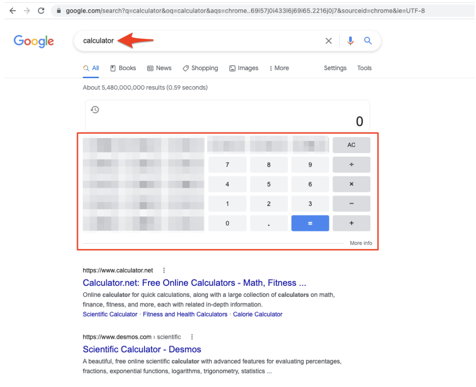

## Test Suite Goal
The goal is to build an automated end-to-end test suite that tests the functionality of the calculator component on Google. 
Calculator only has the buttons **_0123456789.=+-×÷AC/CE._**

# Set up python environment for autotests
1. Make sure you have python installed on your machine by typing in the console "python --version" 
   (python 3.12 was used for test development)
2. Activate VirtualEnv 
   > source venv/bin/activate
3. Install requirements.txt
   > pip install -r requirements.txt
4. Install PyTest as the default runner (instructions for PyCharm IDE):
   - PyCharm - Preferences - Tools - Python integrated tools - default test runner: pytest

# Run tests
- To run all tests, execute the following script:
  > pytest --browser firefox --headed --slowmo 500

# Additional options:

--headed: By default, Playwright runs browsers in headless mode. Use this argument to run tests in headed mode.

--browser: Specify the browser to use for running tests. Options are chromium, firefox, or webkit. You can specify multiple browsers.
  Example:
  > pytest --headed --browser webkit --browser firefox

--browser-channel: Use this argument if you need to run tests in Chrome and Edge browsers installed on your computer.
  Example:
  > pytest --browser-channel=msedge --headed

--slowmo: Use this argument to slow down test execution by the specified number of milliseconds.
  Example:
  > pytest --slowmo 1000